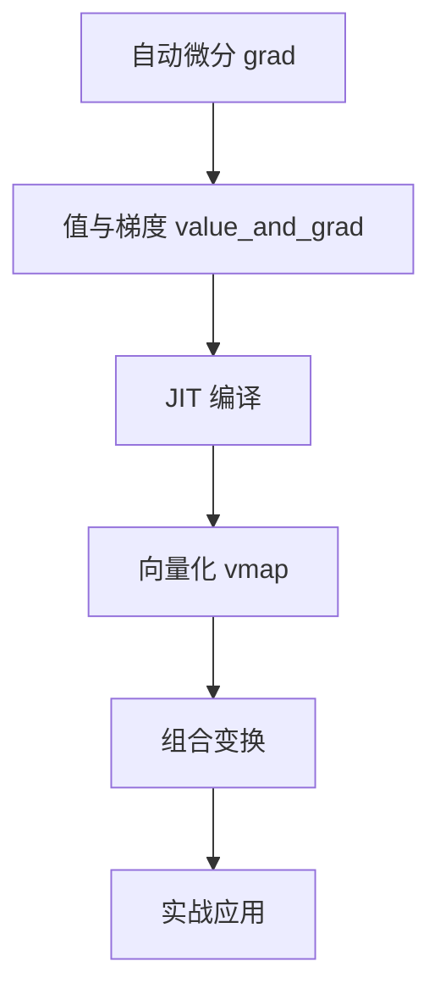

# JAX 变换概述

JAX 的核心优势在于其强大的函数变换（transformations）系统。这些变换可以将普通的 Python 函数转换为高性能、可微分、可向量化的计算。

## 🎯 核心变换

JAX 提供四大核心变换：

| 变换 | 功能 | 主要用途 |
|------|------|----------|
| **grad** | 自动微分 | 计算梯度，训练神经网络 |
| **jit** | 即时编译 | 加速代码执行 |
| **vmap** | 自动向量化 | 批处理，避免显式循环 |
| **pmap** | 并行映射 | 多设备并行计算 |

### 为什么变换重要？

```python
# 普通函数
def loss(params, x, y):
    pred = model(params, x)
    return jnp.mean((pred - y) ** 2)

# 一行代码添加功能：
grad_fn = jax.grad(loss)           # 自动求导
fast_loss = jax.jit(loss)          # JIT 加速
batch_loss = jax.vmap(loss)        # 自动批处理
parallel_loss = jax.pmap(loss)     # 多GPU并行

# 甚至可以组合：
fast_grad = jax.jit(jax.grad(loss))  # JIT编译的梯度函数
```

## 📚 章节内容

### 01. 自动微分（grad）

学习 JAX 的自动微分系统：
- 前向模式和反向模式自动微分
- `jax.grad` 的使用
- 多参数梯度
- 高阶导数
- 链式法则的自动应用

**数学基础**：微积分、链式法则、雅可比矩阵

### 02. 值与梯度（value_and_grad）

同时计算函数值和梯度：
- `jax.value_and_grad` 的优势
- 在优化中的应用
- 避免重复计算
- 训练循环中的使用

**应用场景**：深度学习训练、优化算法

### 03. JIT 编译（jit）

即时编译加速计算：
- XLA（Accelerated Linear Algebra）编译器
- 静态形状要求
- 编译缓存
- 性能提升的原理
- 常见陷阱（动态形状、副作用）

**性能提升**：10-100倍加速

### 04. 向量化（vmap）

自动批处理和向量化：
- 批处理的自动化
- 轴映射（in_axes, out_axes）
- 嵌套 vmap
- 与 einsum 的对比
- 内存和性能权衡

**使用场景**：批量数据处理、蒙特卡洛模拟

### 05. 组合变换（combining）

变换的组合和嵌套：
- 变换的可组合性
- 常见组合模式
- 顺序的影响
- 最佳实践

**强大之处**：`jit(vmap(grad(...)))`

## 🔬 数学原理概览

### 自动微分的链式法则

对于复合函数 $f(g(x))$：

$$\frac{d}{dx} f(g(x)) = f'(g(x)) \cdot g'(x)$$

JAX 自动应用链式法则到任意深度的函数组合。

### 向量化的数学表示

对于函数 $f: \mathbb{R}^n \to \mathbb{R}^m$：

**标量版本**：
$$y_i = f(x_i), \quad i = 1, 2, \ldots, k$$

**向量化版本**：
$$\mathbf{Y} = \text{vmap}(f)(\mathbf{X})$$

其中 $\mathbf{X} = [x_1, x_2, \ldots, x_k]$，$\mathbf{Y} = [y_1, y_2, \ldots, y_k]$

### JIT 编译优化

JIT 通过以下方式优化代码：
1. **融合操作**：多个操作合并为一个核
2. **消除冗余**：移除不必要的计算
3. **内存优化**：减少内存分配和传输
4. **特化代码**：针对具体形状和数据类型优化

## 💡 核心概念

### 函数式编程范式

JAX 变换要求函数是**纯函数**（pure function）：

**纯函数特性**：
- 无副作用（不修改全局状态）
- 确定性（相同输入产生相同输出）
- 无隐藏依赖（只依赖参数）

```python
# ✅ 纯函数 - 适合 JAX
def pure_fn(x):
    return x ** 2 + 1

# ❌ 非纯函数 - 不适合 JAX
counter = 0
def impure_fn(x):
    global counter
    counter += 1  # 副作用！
    return x ** 2
```

### 变换的可组合性

JAX 变换可以任意嵌套和组合：

```python
# 各种组合
jax.jit(jax.grad(f))          # JIT编译的梯度
jax.grad(jax.jit(f))          # 梯度的JIT（不常用）
jax.vmap(jax.grad(f))         # 批量梯度
jax.grad(jax.vmap(f))         # vmap函数的梯度
jax.jit(jax.vmap(jax.grad(f))) # 三者组合
```

### 静态 vs 动态

JAX 变换对静态和动态值有不同处理：

**静态值**：编译时已知（形状、数据类型）
**动态值**：运行时才知道（数组内容）

```python
@jax.jit
def f(x, n):
    # x 的内容是动态的 ✓
    # n 如果用于控制流，需要是静态的
    return x[:n]  # n 必须是静态的！
```

## 🎓 学习路径

推荐按以下顺序学习：



1. **基础**：先理解 grad，这是一切的基础
2. **优化**：学习 value_and_grad 提高效率
3. **性能**：掌握 JIT 加速代码
4. **扩展**：使用 vmap 处理批量数据
5. **进阶**：组合多个变换
6. **实战**：在神经网络训练中应用

## 🚀 性能对比

### JIT 编译的性能提升

```python
import time
import jax.numpy as jnp

def compute(x):
    for _ in range(100):
        x = jnp.dot(x, x.T)
    return x

x = jnp.ones((100, 100))

# 未编译
start = time.time()
result = compute(x)
result.block_until_ready()
print(f"未编译: {time.time() - start:.4f}秒")

# JIT 编译
compute_jit = jax.jit(compute)
start = time.time()
result = compute_jit(x)  # 首次调用会编译
result.block_until_ready()
print(f"首次JIT: {time.time() - start:.4f}秒")

start = time.time()
result = compute_jit(x)  # 使用缓存的编译结果
result.block_until_ready()
print(f"缓存JIT: {time.time() - start:.4f}秒")
```

### vmap vs 循环

```python
def process_single(x):
    return jnp.dot(x, x.T)

batch = jnp.ones((100, 50, 50))

# 使用循环
start = time.time()
results = jnp.array([process_single(x) for x in batch])
results.block_until_ready()
print(f"循环: {time.time() - start:.4f}秒")

# 使用 vmap
process_batch = jax.vmap(process_single)
start = time.time()
results = process_batch(batch)
results.block_until_ready()
print(f"vmap: {time.time() - start:.4f}秒")
```

## ⚡ 实战应用

### 神经网络训练循环

```python
# 组合多个变换的典型训练循环
@jax.jit
def train_step(params, x, y, learning_rate):
    # value_and_grad: 同时获取损失和梯度
    loss_value, grads = jax.value_and_grad(loss_fn)(params, x, y)

    # 更新参数
    params = jax.tree_map(
        lambda p, g: p - learning_rate * g,
        params, grads
    )

    return params, loss_value

# vmap 用于批处理
batch_train_step = jax.vmap(
    train_step,
    in_axes=(None, 0, 0, None),  # params 不批处理，x和y批处理
    out_axes=(None, 0)
)
```

### 蒙特卡洛模拟

```python
def monte_carlo_single(key):
    """单次蒙特卡洛采样"""
    sample = jax.random.normal(key, (1000,))
    return jnp.mean(sample ** 2)

# vmap 实现并行采样
keys = jax.random.split(jax.random.PRNGKey(0), 10000)
results = jax.vmap(monte_carlo_single)(keys)
estimate = jnp.mean(results)
```

## ⚠️ 常见陷阱预览

### 1. 副作用

```python
# ❌ 错误：JIT中的print不会按预期工作
@jax.jit
def f(x):
    print(f"x = {x}")  # 只在编译时打印一次！
    return x + 1

# ✅ 调试方法
def f(x):
    jax.debug.print("x = {}", x)  # 使用 jax.debug.print
    return x + 1
```

### 2. 动态形状

```python
# ❌ 错误：JIT 中的动态形状
@jax.jit
def f(x, n):
    return x[:n]  # n 必须是静态的！

# ✅ 解决方案
def f(x, n):
    return jax.lax.dynamic_slice(x, (0,), (n,))
```

### 3. 忘记 block_until_ready

```python
# ❌ 错误：性能测试不准确
start = time.time()
result = jax.jit(f)(x)
print(time.time() - start)  # 不准确！

# ✅ 正确：等待计算完成
start = time.time()
result = jax.jit(f)(x)
result.block_until_ready()
print(time.time() - start)  # 准确
```

## 🛠️ 调试技巧

### 渐进式应用变换

```python
# 1. 先确保函数正确
def f(x):
    return x ** 2 + 1

# 2. 测试函数
assert f(2.0) == 5.0

# 3. 添加 grad
grad_f = jax.grad(f)
assert grad_f(2.0) == 4.0

# 4. 添加 jit
fast_f = jax.jit(f)
assert fast_f(2.0) == 5.0

# 5. 添加 vmap
batch_f = jax.vmap(f)
assert jnp.allclose(batch_f(jnp.array([1., 2., 3.])),
                     jnp.array([2., 5., 10.]))
```

### 使用 jax.make_jaxpr

```python
# 查看 JAX 的中间表示
from jax import make_jaxpr

def f(x):
    return x ** 2 + 1

jaxpr = make_jaxpr(f)(2.0)
print(jaxpr)  # 显示编译后的计算图
```

## 📖 配套练习

| 练习 | 难度 | 变换 | 重点 |
|------|------|------|------|
| transform01_grad | ⭐⭐ | grad | 基础求导 |
| transform02_value_and_grad | ⭐⭐ | value_and_grad | 优化效率 |
| transform03_jit | ⭐⭐⭐ | jit | 编译加速 |
| transform04_vmap | ⭐⭐⭐ | vmap | 向量化 |
| transform05_combining | ⭐⭐⭐⭐ | 组合 | 综合应用 |

## 🔗 相关资源

- [JAX 自动微分文档](https://jax.readthedocs.io/en/latest/jax-101/04-advanced-autodiff.html)
- [JAX JIT 编译指南](https://jax.readthedocs.io/en/latest/jax-101/02-jitting.html)
- [JAX vmap 教程](https://jax.readthedocs.io/en/latest/jax-101/03-vectorization.html)

## ✅ 学习检查清单

完成本章后，你应该能够：

- [ ] 理解自动微分的原理并使用 grad
- [ ] 使用 value_and_grad 优化训练循环
- [ ] 应用 JIT 编译加速代码
- [ ] 使用 vmap 实现批处理
- [ ] 组合多个变换解决复杂问题
- [ ] 识别和避免常见陷阱
- [ ] 编写符合 JAX 风格的纯函数
- [ ] 在实际项目中灵活运用变换

---

准备好后，从[自动微分](grad.md)开始你的变换之旅！
